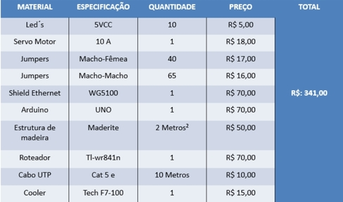
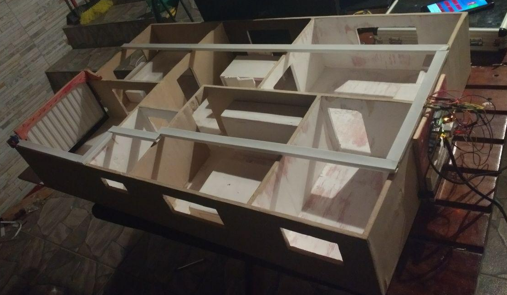
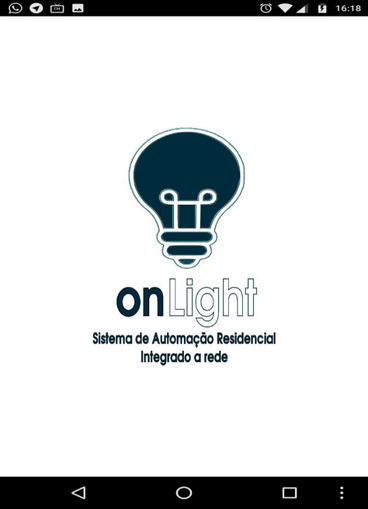
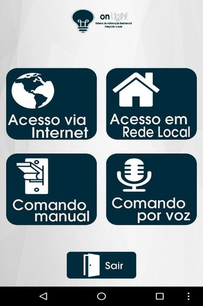
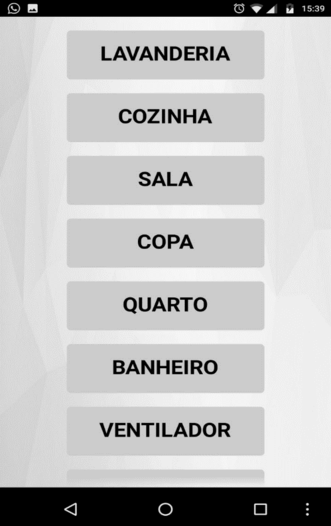
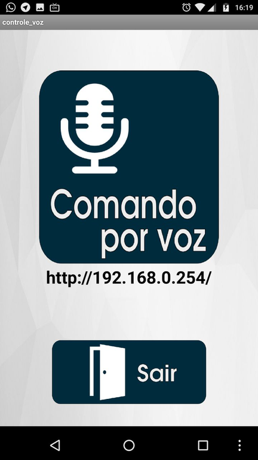
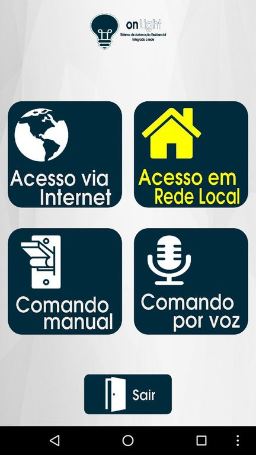
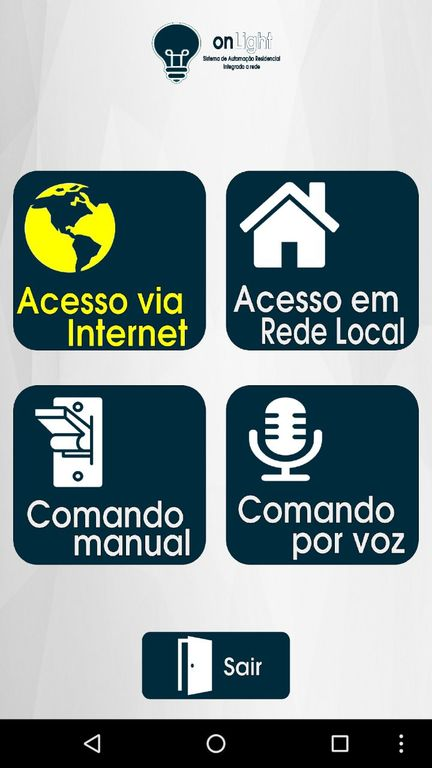
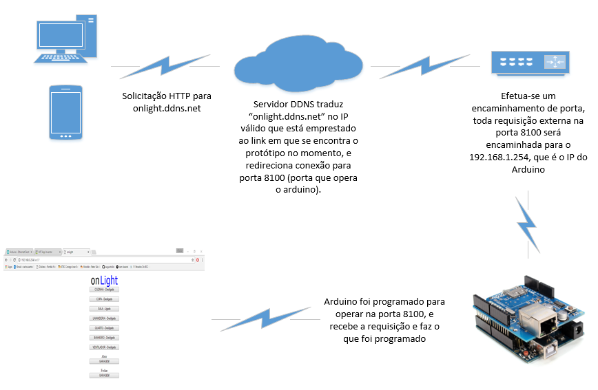
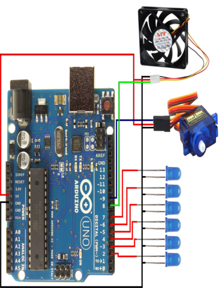

# onLight - Casa Inteligente Arduino :house:

Projeto de TCC para o curso Técnico em Redes de Computadores, pela ETEC Cônego José Bento de Jacareí/SP.

## Integrantes

- Bryan Lima ([@bryan-lima](https://github.com/bryan-lima))
- Carlos Augusto dos Santos Neto ([@c-neto](https://github.com/c-neto))
- José Danrley da Silva ([@JDanrley](https://github.com/JDanrley))

## Sobre

O projeto demonstra um protótipo funcional de automação residencial, utilizando uma placa microcontroladora Arduino Uno, um servo motor e LED's em uma maquete de residência feita em madeirite. 

O sistema permite acender e apagar luzes, além de abrir e fechar o portão, e pode ser gerenciado por meio de uma página HTML ou pelo aplicativo **OnLight** (desenvolvido especificamente para esse fim) tanto localmente quanto remotamente.

## Tecnologias utilizadas

Além das tecnologias que constam na tabela abaixo, também foi usado o [noIp](https://www.noip.com/) para o serviço de DDNS, [GIMP](https://www.gimp.org/) e [Inkscape](https://inkscape.org/) para edição e criação do layout do aplicativo  

## Projeto em Funcionamento

Há uma demonstração em vídeo do projeto em funcionamento hospedado no [Youtube (clique aqui)](https://youtu.be/0SM0SN_xg8M).

### Estrutura Física do Projeto

Maquete de uma residência, construída em madeirite.

### Aplicativo (Android)

#### Splash Screen

Tela de abertura do aplicativo.

#### Menu Principal

O menu principal do aplicativo, possui as seguintes opções:
- [Acesso via Internet](#acesso-via-internet)
- [Acesso em Rede Local](#acesso-em-rede-local)
- [Comando Manual](#comando-manual)
- [Comando por Voz](#comando-por-voz)
- Sair

#### Comando Manual

Ao clicar na opção **Comando Manual**, o aplicativo exibirá os cômodos da casa nos quais é possível acender ou apagar a lâmpada, além de abrir e fechar o portão.

 

#### Comando por Voz

Ao clicar no ícone **Comando por Voz**, o aplicativo irá habilitar o microfone do smartphone para reconhecer o comando.

Para acender ou apagar a luz de um cômodo, após clicar no microfone, basta falar o nome do cômodo desejado, como por exemplo "sala" ou "banheiro".

Para abrir ou fechar o portão da garagem, é necessário falar "abrir garagem" ou "fechar garagem", respectivamente.

#### Acesso em Rede Local

Ao clicar no ícone **Acesso Local**, o aplicativo funcionará em abrângencia geográfica limitada ao alcance do aceess point de roteador da rede.

#### Acesso via Internet

Ao clicar no ícone **Acesso Via Internet**, o aplicativo funcionará em abrângencia geográfica mundial, desde que o dispositivo tenha acesso a Internet.

### Topologias do Projeto

#### Infraestrutura

Detalhamento da infraestrutura do projeto.

#### Conexões do Arduino

Esquema de pinagem do Arduino.

---

## Licença

Este projeto é propriedade de Bryan Lima, Carlos Augusto dos Santos Neto, e José Danrley da Silva. Todos os direitos são reservados. O uso, distribuição, cópia ou modificação deste código sem a permissão expressa por escrito do autor é estritamente proibido.

Para mais informações, leia o arquivo [LICENSE](./LICENSE).
